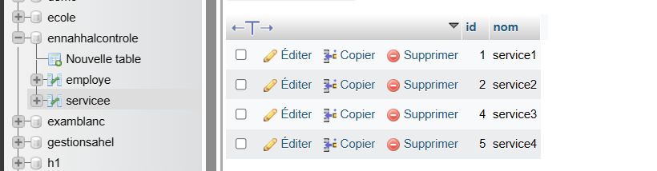

# Controle Spring Boot

#### Quelques tests avec Swagger 

### Test d'API GET de service

### Test d'API Post de service

## La base de données après ces modifications

### Test d'API Delete de service

### Test d'API GET by ID d'employe

### Test d'API GET tous de employe

### Test d'API Delete d'employe

